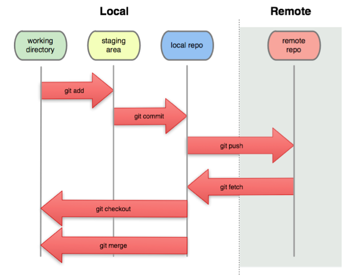
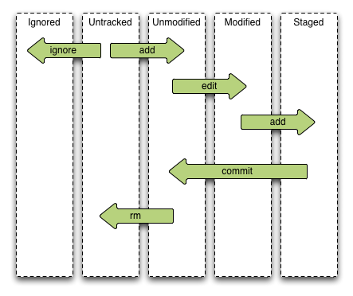

!SLIDE
# Git Basics #

!SLIDE commandline incremental 
## Unser erstes Repository ##

    $ git init
    $ touch readme.txt
    $ git add readme.txt
    $ git status
    $ git commit 
    $ mkdir subdir 
    $ touch readme2.txt
    $ git status
    $ git add .
    $ git commit -m "a second readme file"

.notes explain content tracking (folders have no meaning, you cannot add an empty dir to git)  no .git dir in subfolders

!SLIDE center
# Die 4 Stufen in git #

.notes commit often, not only for yourself also for git to help tracking eg renames   overview of the staging areas

!SLIDE center
# Git Datei Stati #
 

.notes explain file stati

!SLIDE
## remove, rename and ignoring files ##

!SLIDE commandline
## remove ##
    $git rm filename
  
    $rm filename
    $git add filename

!SLIDE commandline
## rename 
    $git mv from to

    $mv from to
    $git add to

!SLIDE code
## rename detection      
    detect renames 
    $git log -M80%     

!SLIDE commandline
## Ignoring Files ##

* Datei mit dem Namen ".gitignore" hinzufügen
* mehrere ".gitignore" Datein in Unterordner möglich
* "Shell Glob Patterns" können verwendet werden z.B. "*.log"

!SLIDE
# .gitignore #

    config/database.yml
    config/*.sphinx.conf
    *.cache
    *.log
    *.pid
    tmp/**/*
    .DS_Store
    doc/*.dot
    coverage/*
    db/*.sqlite3

!SLIDE 
# Performance

.notes use the time command to show speed   use script to commit 1000 of files

