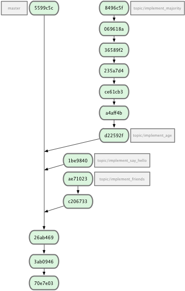

!SLIDE subsection
# Übung #
## Zusammenführen von Branches ##

!SLIDE
## Wo? ##
    $ git clone ./workshop/excercise.bundle

## Was? ##
Beispiel Ruby-Gem mit Specs

Features auf Branches => integrieren

## Ziel? ##
Git präzise einsetzen

Arbeiten mit Branches

Graph verstehen

Merge Konflikte beheben

!SLIDE center
# Ausgangslage #

!SLIDE
# Aufgaben #
* Die Feature-Branches auf 3 verschiedene Arten integrieren
* Jede Art hat Vor-/Nachteile halte die Erfahrungen fest
  * Mühsam?
  * Viele Konflikte?
  * Graph verständlich/hilfreich?

!SLIDE bullets
# Integration I #

Die Features werden durch einfaches mergen integriert.

1. Skizziere den resultierenden Graphen
1. Integriere die Features
1. Vergleiche den gezeichneten Graphen mit deinem Resultat

!SLIDE smbullets
# Integration II #

Integriere die Features ohne Merge-Commits auf dem 'master' Branch

1. Skizziere den resultierenden Graphen
1. Integriere die Features
1. Vergleiche den gezeichneten Graphen mit deinem Resultat

!SLIDE bullets
# Integration III #

Integriere die Features dass eine lineare History entsteht aber
Merge-Commits sichtbar sind.

1. Skizziere den resultierenden Graphen
1. Integriere die Features
1. Vergleiche den gezeichneten Graphen mit deinem Resultat

!SLIDE subsection
# Lösung #
## Zusammenführen von Branches ##

!SLIDE smaller
# Integration I #

    $ git checkout master
    $ git merge topic/implement_say_hello
    $ git merge topic/implement_friends
    $ git merge topic/implement_majority

!SLIDE smaller
# Integration I [Graph] #
        *   5172778 Merge branch topic/implement_majority'
        |\
        * |   956cdb7 Merge branch topic/implement_friends'
        |\ \
        | |/
        * |   c14edfe Merge branch topic/implement_say_hello'
        |\ \
        | |/
        * | b2c20f8 run specs via rake
        |/
        * 26ab469 Persons have names
        * 3ab0946 + use rspec for testing
        * 70e7e03 initial commit

!SLIDE smaller
# Integration II #

    $ git checkout topic/implement_majority
    $ git rebase master
    $ git checkout master
    $ git merge --ff-only topic/implement_majority

    $ git checkout topic/implement_friends
    $ git rebase master
    ...

!SLIDE smaller
# Integration II [Graph] #

        * 66b85b2 a Person can say_hello
        * 7d3f670 a Person knows it's friends
        * 3baf999 Persons have many friends
        * 5d38c71 formatting changes, teenager? method, Readme and new version
        * e1ec5fa forgot to add method name to 'private' call
        * d6bb0dc validate age >= 0
        * cba343d added additional examples to make sure 'of_age' is working
        * e21d909 Fixed typo in 'of_age' spec
        * d5b6422 People over 18 are of age
        * 36ead7b a Person has an age
        * b2c20f8 run specs via rake
        * 26ab469 Persons have names
        * 3ab0946 + use rspec for testing
        * 70e7e03 initial commit

!SLIDE smaller
# Integration III #

    $ git checkout topic/implement_friends
    $ git rebase master
    $ git checkout master
    $ git merge --no-ff topic/implement_friends

    $ git checkout topic/implement_say_hello
    $ git rebase master
    ...

!SLIDE smaller
# Integration III [Graph] #

        *   6f87723 Merge branch 'topic/implement_majority'
        |\
        |/
        *   11eb2bf Merge branch 'topic/implement_age'
        |\
        |/
        *   c731a41 Merge branch 'topic/implement_say_hello'
        |\
        |/
        *   f8e1e63 Merge branch 'topic/implement_friends'
        |\
        |/
        * b2c20f8 run specs via rake
        * 26ab469 Persons have names
        * 3ab0946 + use rspec for testing
        * 70e7e03 initial commit
