!SLIDE subsection
# Git Internals #

!SLIDE bullets
# Der .git Ordner #

* Konfigurationsdatei
* Hooks
* Index
* Objektdatenbank
* Referenzen

!SLIDE
# Objekt Datenbank #

!SLIDE center
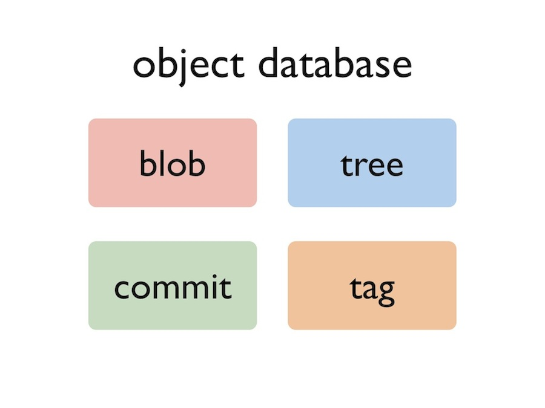

!SLIDE center
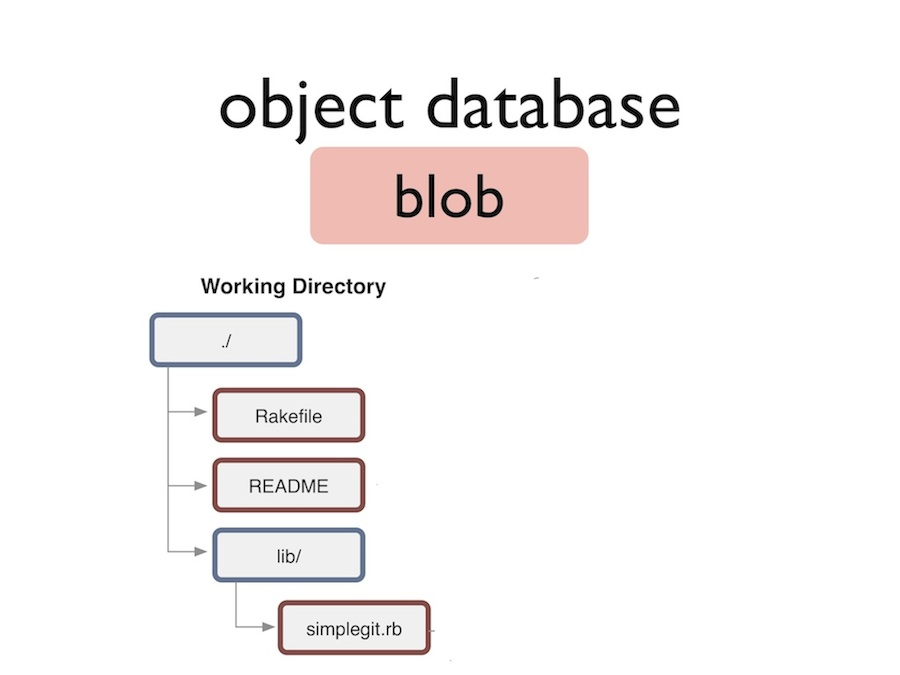

!SLIDE center
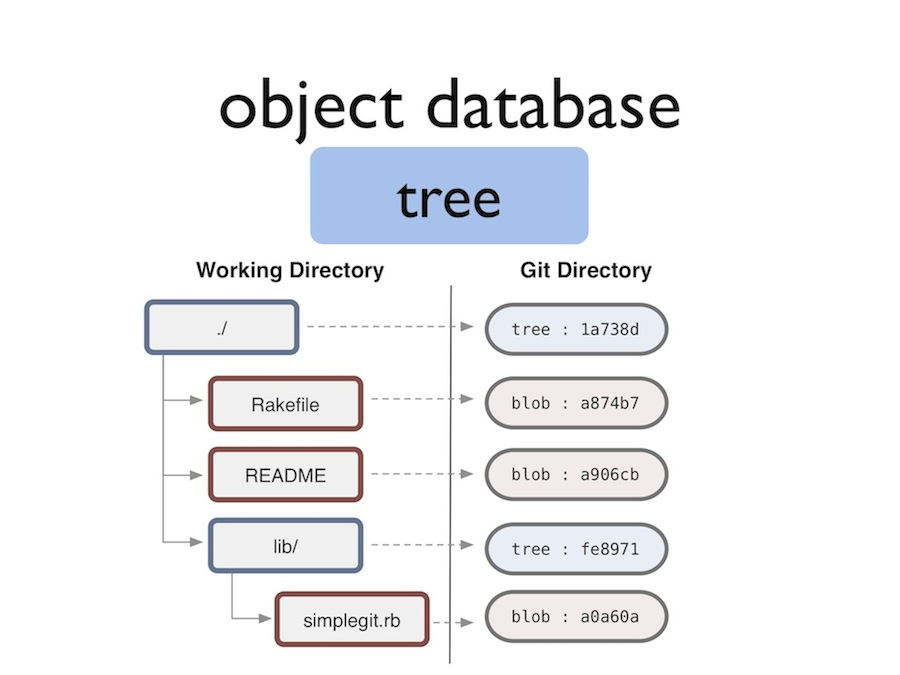

!SLIDE center
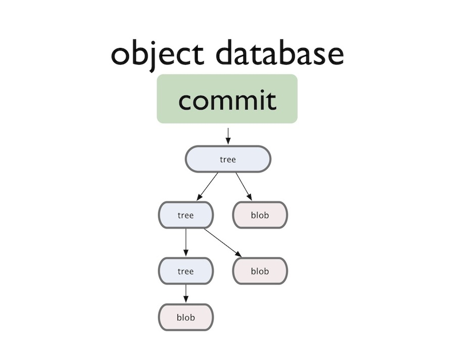

!SLIDE center
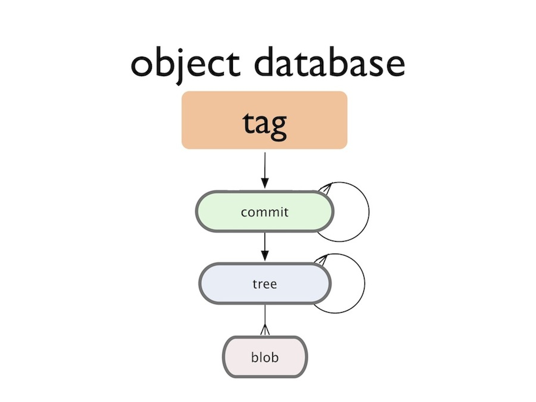

!SLIDE bullets
# Referenzen #

* Pointer auf ein Commit Objekt
* Werden im Ordner .git/refs gespeichert
* Datei mit dem Commit-Hash als Inhalt

!SLIDE commandline
    $ cat .git/refs/heads/master
    2d5f0b92c01b3af6b18fa9fd4b9457f28c55f8c9

!SLIDE bullets
# Symbolische Referenzen #

* Pointer auf ein Branch oder Commit Objekt
* Werden im Ordner .git/ gespeichert
* Datei mit dem Pfad zum Branch oder Commit-Hash als Inhalt

!SLIDE commandline

## Branch ##
    $ git checkout master
    $ cat .git/HEAD
    ref: refs/heads/master

## Commit (detached HEAD) ##
    $ git checkout 3ab0946
    $ cat .git/HEAD
    3ab0946694019e9ec819cddd4999b635449ecc25

!SLIDE
# Vorgänge in einem Repository #

!SLIDE center
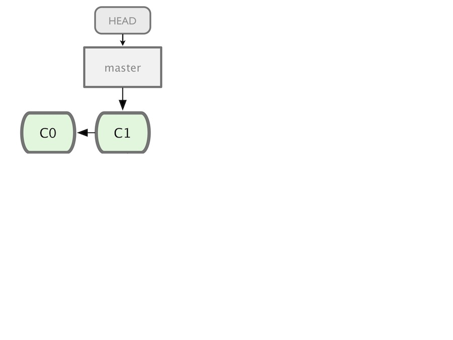

!SLIDE center
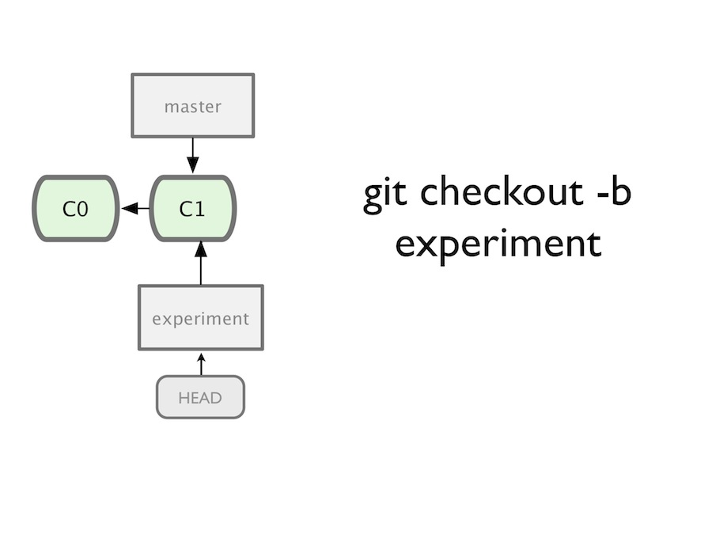

!SLIDE center
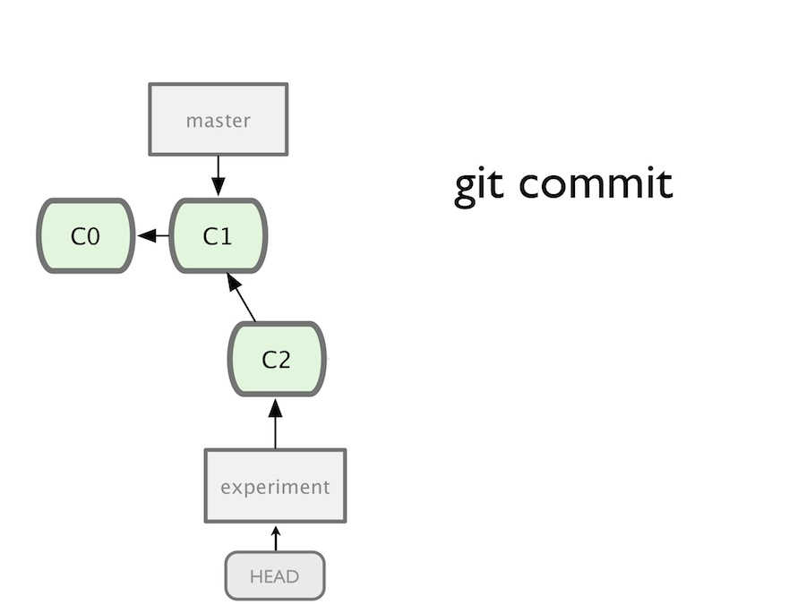

!SLIDE center
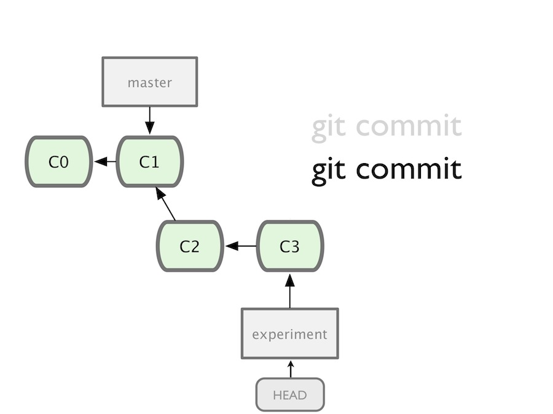

!SLIDE center
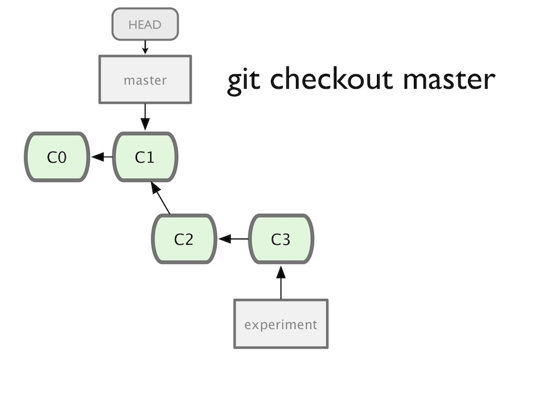

!SLIDE center
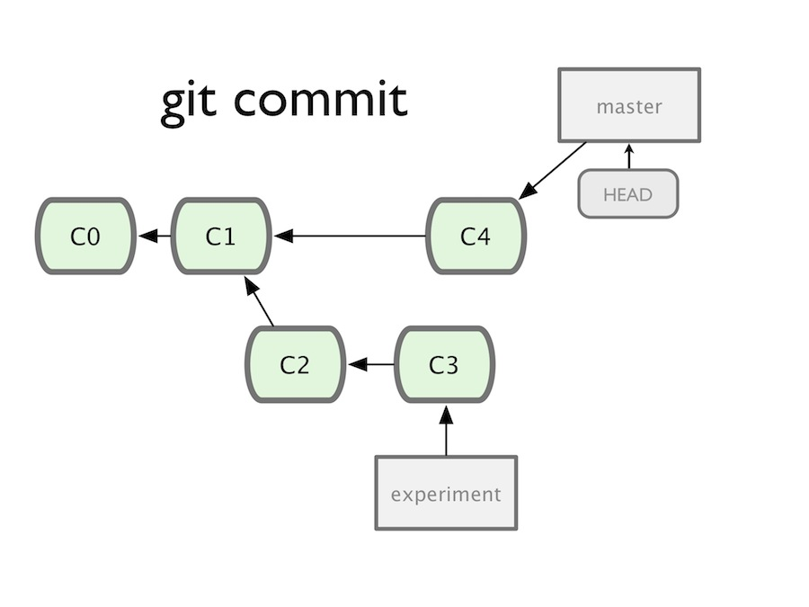

!SLIDE center
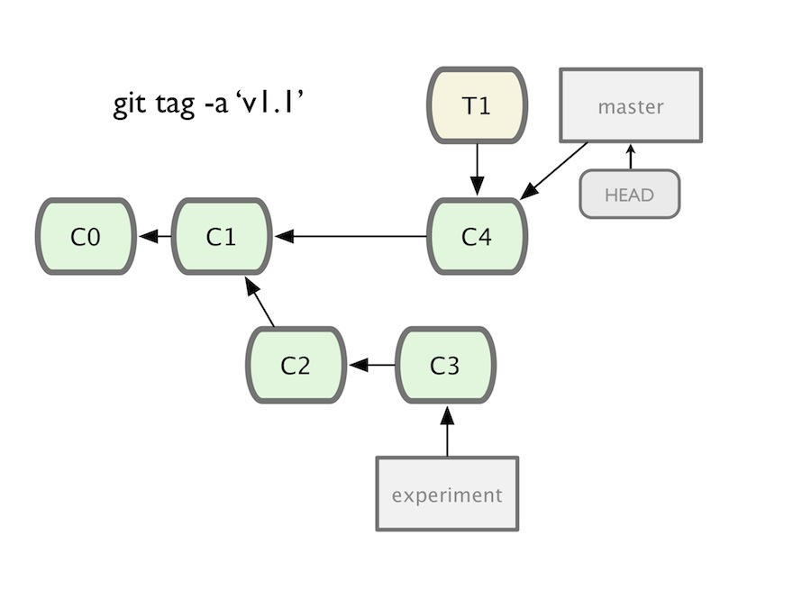

!SLIDE center

!SLIDE center
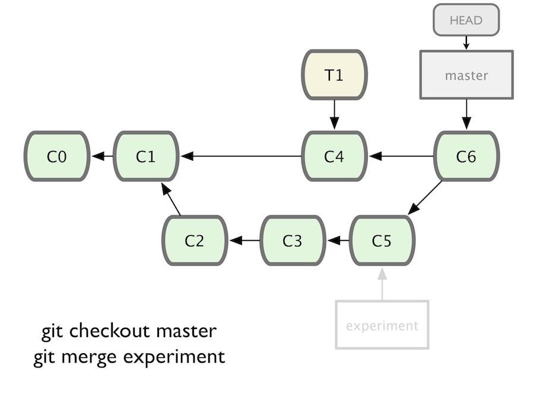

!SLIDE
# Commits benennen #

!SLIDE
# SHA-1 Hash #

    b645be7a5d01cb5e143fcd2c0581a4dc69c595b9

!SLIDE
# Partial SHA-1 #

    b645be7a5d01cb5e143fcd2c0581a4dc69c595b9
    b645be7a5d01cb5e1
    b645be7a5d
    b645be7

!SLIDE
# Branch, Remote or Tag Name #

    origin/master
    refs/remotes/origin/master
    master
    refs/heads/master
    v1.0
    refs/tags/v1.0

!SLIDE
# Carrot Parent #

    master^
    master^2
    master^3

!SLIDE
# Tilde Spec #

    master~2
    master~3
    master~7

!SLIDE
# Date Spec (Lokal) #

    master@{yesterday}
    master@{1 month ago}

!SLIDE
# Ordinal Spec (Lokal) #

    master@{1}
    master@{5}

!SLIDE
# Blob Spec #

    <treeish>:<path>

    master:/path/to/file
    my_feature:/app/models/person.rb
    release/1.0:/spec/models/person_spec.rb

!SLIDE
# Range #

    <treeish>..<treeish>

    7b593b5..51bea1
    master..my_feature
